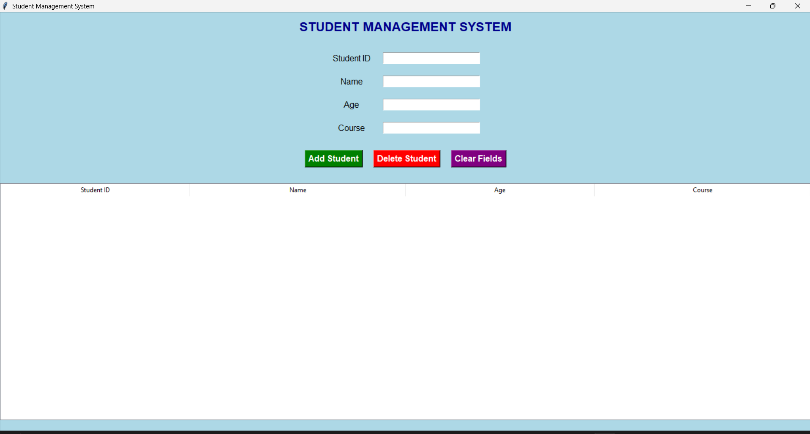
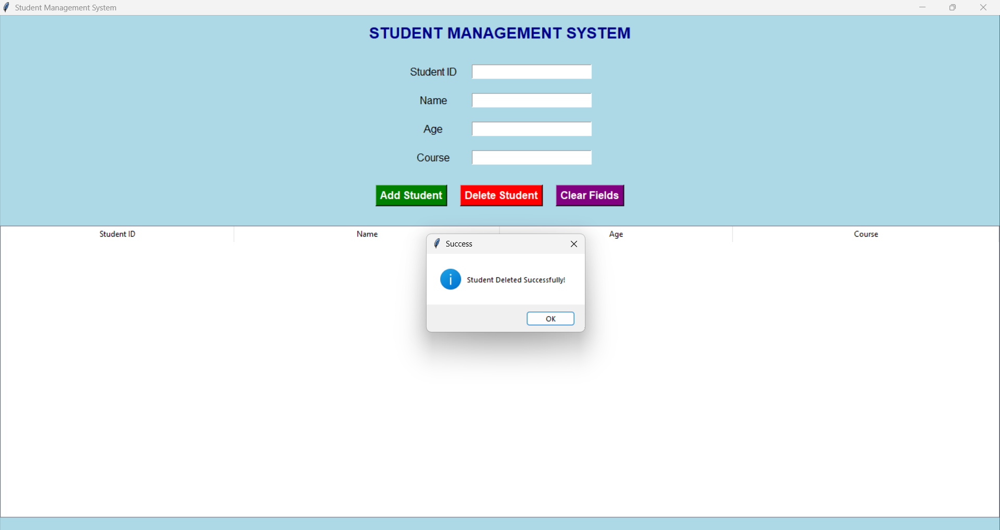

# # Student Management System using Tkinter

A simple GUI-based Student Management System built using Python and Tkinter.

## Features
- Add Student
- Delete Student
- View Records
- GUI Interface

## Technologies Used
- Python
- Tkinter
 
## 📸 Screenshots

### Home Screen

### Add Student

### delete Students

